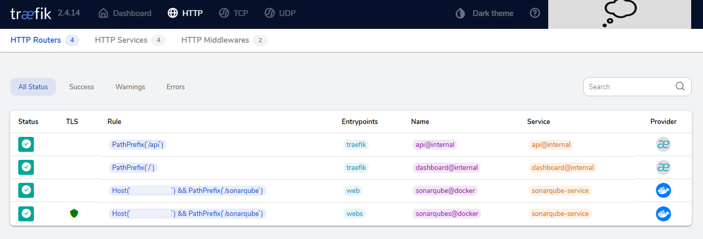

# SIMPLE-PROJECT-MANAGER 
### <`Spring Boot`> + <`Docker`> + <`Docker-Compose`> + <`React`> + <`Typescript`> + <`Hibernate`> + <`PostgreSQL`> + <`Redis`> + <`Nexus`> + <`Golang`>

> Application Developed for Release Preparation/Management of Projects. (It is still in the development and testing phase.)

## Includes:

Front-end:

- `React` and `Typescript` boilerplate files
- `AntD` (Ant Design) React UI library
- `Axios` promise-based HTTP Client

Back-end:

- `SpringBoot` boilerplate files
- `Maven` build project structure
- `Hibernate` Object Oriented Database Management 
- `PostgreSQL` relational database integration
- `Redis` in-memory key–value database (Cache) integration
- `log4j2` new generation logging
- `JUnit` unit tests

Platforms:
- `Docker` and `Docker-Compose` container technologies
- `Sonarqube` static code analysis and coverage platform
- `Traefik` routing, load balancing, and proxy solution
- `Nexus` repository manager 

## Setup

You should install above technologies and tools to your computer. You can search these instructions in Google.

Then, you should run `pre-setup.bat` batch file for copying of setup files to your computer.

After this instruction, you should up docker-compose.yml like below:

> docker-compose -f docker-compose.yml up

## Build and Run

First of all you need to configure the database. Properties are located in `./backend/nexus-service/src/main/resources/application.properties` file.

> By default application is using PostgreSQL and Redis databases.
> 
> `Redis` database (user: `user`, password: `password`).

> By default application is using Nexus repository manager.
> 
> `Nexus` repository manager (user: `admin`, password: `admin`).

1. Run `npm clean install --prefix frontend` to install front-end dependencies.
2. Run `npm run build:prod --prefix frontend` to build React/Typescript application.
3. Run `mvn clean compile -f backend/nexus-service` to compile a Spring Boot application.
4. Run `mvn install -f backend/nexus-service` to start Spring Boot application on embedded server.
5. Run `go clean main.go` to clean GoLang application in webhook-service folder.
6. Run `go install main.go` to install dependencies of GoLang application in webhook-service folder.

> By default `SpringBoot backend server` will be running on port `8082`.
>
> By default `Go backend server` will be running on port `8080`.

## Development

- `npm start --prefix frontend` to start front-end server for development.
- `npm run start:prod --prefix frontend` to start front-end server with service-workers.
- `mvn install -f backend/nexus-service` to start Spring Boot application on embedded server.
- `go run main.go` to compile and run GoLang application in webhook-service folder.

> By default `frontend server` will be running on port `3000`

## Testing

- `npm test --prefix frontend` - to run front-end unit tests.
- `mvn test -f backend/nexus-service` - to run Spring Boot backend server tests.
- `go test main.go` - to run GoLang backend server tests.

## Technologies used

Back-end:
- [spring-boot-starter-web](https://mvnrepository.com/artifact/org.springframework.boot/spring-boot-starter-web)
- [spring-boot-starter-security](https://mvnrepository.com/artifact/org.springframework.boot/spring-boot-starter-security)
- [spring-boot-starter-data-jpa](https://mvnrepository.com/artifact/org.springframework.boot/spring-boot-starter-data-jpa)
- [spring-boot-starter-data-mongodb](https://mvnrepository.com/artifact/org.springframework.boot/spring-boot-starter-data-mongodb)
- [spring-boot-starter-hateoas](https://mvnrepository.com/artifact/org.springframework.boot/spring-boot-starter-hateoas)
- [spring-boot-starter-log4j2](https://www.postgresql.org/)
- [postgresql](https://www.postgresql.org/)
- [redis](https://redis.io/)
- [junit](https://mvnrepository.com/artifact/junit/junit)
- [maven](https://maven.apache.org/)

Front-end:
- [react](https://www.npmjs.com/package/react)
- [react-dom](https://www.npmjs.com/package/react-dom)
- [react-redux](https://www.npmjs.com/package/react-redux)
- [react-router-dom](https://www.npmjs.com/package/react-router-dom)
- [react-scripts](https://www.npmjs.com/package/react-scripts)
- [redux](https://www.npmjs.com/package/redux)
- [typescript](https://www.npmjs.com/package/typescript)
- [antd](https://www.npmjs.com/package/antd)
- [axios](https://www.npmjs.com/package/axios)
- [i18next](https://www.npmjs.com/package/i18next)

Platforms:
- [docker](https://www.docker.com/)
- [docker-compose](https://docs.docker.com/compose/)
- [sonarqube](https://www.sonarsource.com/products/sonarqube/)
- [traefik](https://traefik.io/)
- [nexus](https://www.sonatype.com/products/nexus-repository)
- [minio](https://min.io/)

## Screen-Shots

> `All Docker Containers:`
>
> 

> `NexusService (Spring Boot):`
>
> 

> `WebHookService (GoLang):`
>
> 

> `Nexus Page:`
>
> 

> `Redis Page:`
>
> 

> `Sonarqube Page:`
>
> 

> `MinIO Page:`
>
> 

> `Traefik Page:`
>
> 
> 

## License
`simple-project-manager` is released under the [MIT License](https://opensource.org/licenses/MIT).